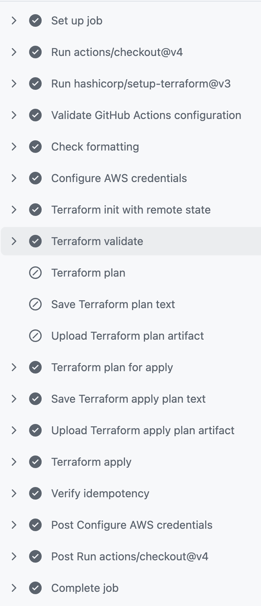
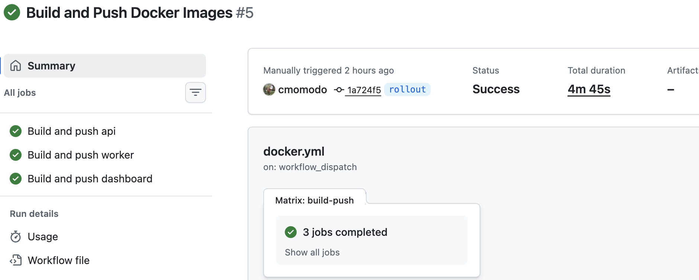
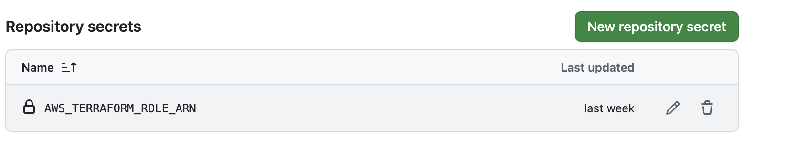
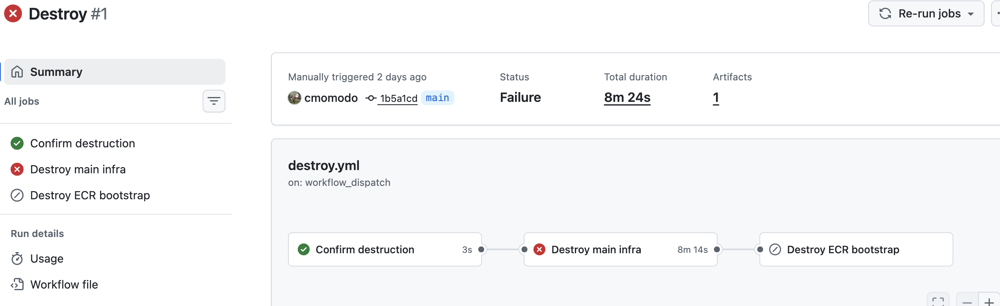

# URL Shortener

A URL shortener with click analytics on AWS. The platform runs three services in ECS Fargate behind CloudFront, WAF, and an Application Load Balancer, stores source-of-truth data in RDS PostgreSQL, uses Redis for hot-path caching, and publishes click events through SQS for async analytics. Terraform manages the infrastructure, GitHub Actions handles CI/CD with OIDC, and CodeDeploy performs blue/green deployments.

## Highlights

- Three-service architecture: API, worker, and dashboard
- ECS Fargate deployment with CodeDeploy blue/green releases
- CloudFront, WAF, and ALB for public ingress
- RDS PostgreSQL as the system of record
- ElastiCache Redis for cacheable redirect lookups
- SQS for click-event processing
- Private VPC design with no NAT gateways
- Terraform-managed networking, IAM, KMS, and remote state
- GitHub Actions OIDC with no long-lived AWS credentials
- Docker Compose for local development

## Architecture


For a compact overview, see [docs/architecture-overview.md](docs/architecture-overview.md).

## Services

| Service | Language | Port | Responsibility |
| --- | --- | --- | --- |
| `api` | Python | `8080` | Shortens URLs, resolves redirects, publishes click events |
| `worker` | Go | - | Consumes SQS events and writes analytics to PostgreSQL |
| `dashboard` | Go | `8081` | Exposes analytics endpoints for top URLs and click stats |

## Repository Layout

- `app/` - API service, tests, and shared app code
- `services/dashboard/` - analytics service
- `services/worker/` - SQS worker
- `infra/` - Terraform for the main AWS stack
- `infra/ecr-chicken/` - bootstrap Terraform for ECR repositories
- `modules/` - Terraform modules used by the infra stacks
- `scripts/` - setup, smoke test, and helper scripts
- `docs/` - architecture, endpoints, pipeline, security, and database notes
- `images/` - README screenshots and diagrams

## Application Endpoints

- `GET /ui` renders the frontend UI
- `GET /healthz` checks app health and reports the active database backend
- `POST /shorten` creates a short URL and stores the mapping
- `GET /{short_id}` redirects to the original URL and publishes a click event
- `GET /stats/{short_id}` returns click counts for a short URL
- Dashboard endpoints live under `/summary`, `/top`, `/recent`, and `/url/{short_code}`

## Local Development

```bash
cp .env.example .env
docker compose up --build
```

Optional smoke test:

```bash
./scripts/smoke_sqs.sh
```

## Deploy With Terraform

If the ECR repositories do not already exist, bootstrap them first:

```bash
cd infra/ecr-chicken
terraform init
terraform apply
```

Then deploy the main stack:

```bash
cd ../
terraform init
terraform apply
```

## CI/CD

- GitHub Actions authenticates to AWS with OIDC
- `bootstrap.yml` creates the ECR repositories
- `ci.yml` applies the main Terraform stack
- `docker.yml` builds and pushes the service images
- `deploy.yml` triggers the service rollout

For pipeline details, see [docs/pipelines.md](docs/pipelines.md).

## Screenshots

- URL shortener UI
  
- Infrastructure deploy
  
- Docker matrix build
  
- OIDC setup
  
- Destroy workflow
  

## Design Notes

- RDS PostgreSQL is the active database because the API, worker, and dashboard all share a relational data model.
- DynamoDB would work for hot redirect lookups, but it would complicate the analytics and dashboard query paths.
- Aurora PostgreSQL would fit a larger production workload, but it adds cost and complexity that this project does not need yet.
- CloudFront, WAF, and ALB split edge protection from service routing.
- Private subnets, SSM parameters, and KMS keep runtime configuration cleaner than hardcoded values.

## More Docs

- [Endpoints](docs/endpoints.md)
- [Database](docs/database.md)
- [Terraform](docs/terraform.md)
- [Security](docs/security.md)
- [Pipeline docs](docs/pipelines.md)
