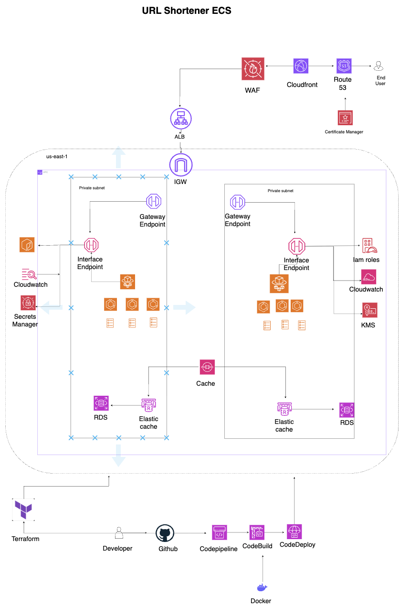

# URL Shortener - CoderCo ECS Project v2

A URL shortener with click analytics on AWS. Three services, one cluster. The deployment uses RDS PostgreSQL as the system of record, Redis for API caching, and SQS for asynchronous click analytics.

## Services

| Service       | Language | Port | Description                                                              |
| ------------- | -------- | ---- | ------------------------------------------------------------------------ |
| **api**       | Python   | 8080 | Shortens URLs, handles redirects, tracks clicks, publishes events to SQS |
| **worker**    | Go       | -    | Polls SQS for click events, writes analytics to PostgreSQL               |
| **dashboard** | Go       | 8081 | Analytics API - top URLs, click stats, hourly breakdowns, recent events  |

Read the code. Environment variables and endpoints are in the source files.

---

## Requisites

Docker
Terraform
AWS

# System Design



### Features

- ECS Fargate - three separate services, one cluster
- Application Load Balancer with WAF routing to the correct service
- Database: RDS PostgreSQL, selected for the shared URL and analytics schema
- ElastiCache Redis (caching layer for the API; TLS, auth, and dedicated security groups — see [docs/elasticache.md](docs/elasticache.md))
- SQS queue (click events from API to worker)
- VPC with private subnets. No NAT gateways.
- GitHub Actions with OIDC. No long-lived AWS credentials.
- Zero-downtime deployments with rollback on failure
- Least-privilege IAM throughout
- Terraform with remote state
- Multi-stage Docker builds

Terraform uses an S3 backend for remote state, configured in [`infra/state.tf`](/Users/momodou/Documents/projects/Coderco_Projects/url-shortener-main/infra/state.tf). Create the backend bucket once before running `terraform init`, or `init` will fail until the bucket exists.

### Database Decision

This deployment uses **RDS PostgreSQL** because all three services can share one relational data model:

- The API writes URL mappings to the `urls` table and increments click counts during redirects.
- The worker consumes SQS click events and writes `click_events` plus hourly aggregates.
- The dashboard queries `urls`, `click_events`, and `click_stats_hourly` with SQL ordering, filtering, and aggregation.

RDS PostgreSQL is the lowest-risk fit for the current application because the worker and dashboard already require `DATABASE_URL` and use PostgreSQL SQL directly. A dev-sized single-AZ instance keeps the deployment simple and cost-conscious while preserving the query patterns needed by the analytics dashboard.

**DynamoDB** would be a good alternative for the hot redirect lookup path because `short_code -> url` is a simple key-value access pattern and on-demand billing can be cheaper at low or spiky traffic. It is not the active deployment choice here because the analytics worker and dashboard would need to be rewritten around DynamoDB-specific access patterns for recent clicks, hourly stats, and top URLs.

**Aurora PostgreSQL** is a better fit when the app needs production-grade database scaling, read replicas, or higher availability than a small RDS instance. For this dev-sized ECS project, that added baseline cost and complexity is not justified.

**Aurora DSQL** is a promising serverless distributed SQL option, but it is aimed at active-active and distributed SQL workloads. This service does not currently need multi-region writes or distributed transaction scale, so DSQL would add novelty and migration risk without solving a current problem.

### The Deployment Question

You've deployed the service. Now a developer merges a PR and expects their change live within minutes - safely, with zero downtime.

Design and document the full deployment workflow in your README. Code merge to live traffic.

### Deliverables

- [ ] Dockerfiles (one per service)
- [ ] Terraform for all infrastructure
- [ ] GitHub Actions CI/CD pipeline
- [ ] Deployment workflow documentation
- [ ] Working deployment - all services healthy, end-to-end flow functional
- [ ] README with your decisions, trade-offs and database justification

---

## Local Development

```bash
docker compose up --build
```

To smoke test the SQS publish path locally against default AWS, run:

```bash
./scripts/smoke_sqs.sh
```

---

## Grading

- All three services running and healthy
- End-to-end flow works (shorten -> redirect -> analytics)
- Zero-downtime deployments with auto-rollback on health check failure
- No NAT gateways, no long-lived credentials, no hardcoded secrets
- Deployment workflow section present and coherent
- You can explain every resource you created

**Tear down when done.** ALB + WAF cost money even idle.

Use the default AWS endpoint for SQS testing.

Everything else is on you. Commit small. Good luck.

# url_shortener_ECS
