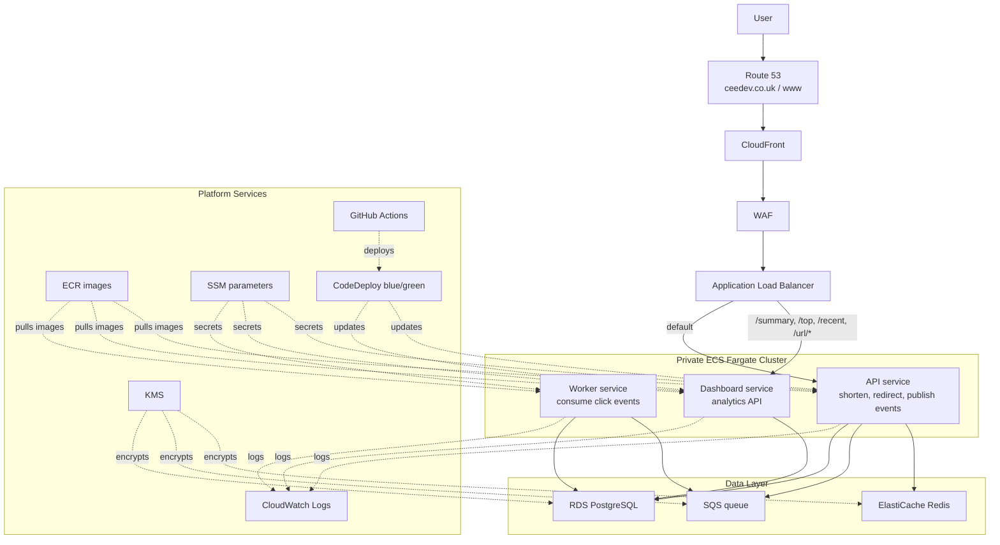

# Architecture Overview

## High-Level Flow

1. The user resolves `ceedev.co.uk` or `www.ceedev.co.uk` through Route 53.
1. Traffic passes through CloudFront and WAF before reaching the public ALB.
1. The ALB routes dashboard requests to the dashboard service and everything else to the API service.
1. The API writes URL data to PostgreSQL, caches reads in Redis, and publishes click events to SQS.
1. The worker consumes SQS messages and persists analytics back to PostgreSQL.
1. GitHub Actions pushes images to ECR and uses CodeDeploy for blue/green updates of the ECS services.
