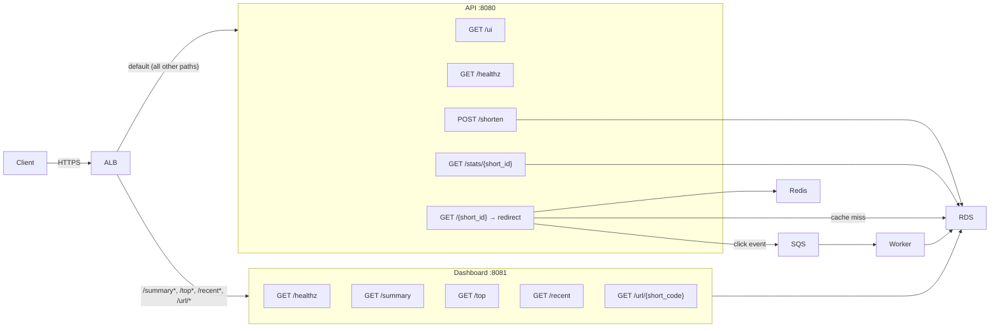
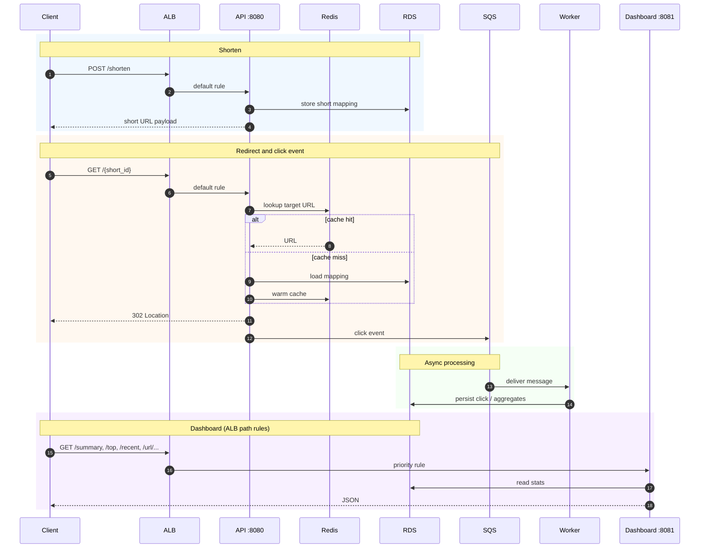

# Endpoint Routing

## Request flows

## ALB Listener Rules

| Priority | Path Pattern | Target |
|----------|-------------|--------|
| 10 | `/summary*`, `/top*`, `/recent*`, `/url/*` | Dashboard :8081 |
| default | `*` | API :8080 |

## API Endpoints

| Method | Path | Description |
|--------|------|-------------|
| GET | `/ui` | Frontend UI |
| GET | `/healthz` | Health check |
| POST | `/shorten` | Create short URL |
| GET | `/stats/{short_id}` | Click count for a short URL |
| GET | `/{short_id}` | Redirect to original URL, publishes click event to SQS |

## Dashboard Endpoints

| Method | Path | Description |
|--------|------|-------------|
| GET | `/healthz` | Health check |
| GET | `/summary` | Total URLs, total clicks, clicks today |
| GET | `/top` | Top 10 URLs by clicks |
| GET | `/recent` | Last 50 click events |
| GET | `/url/{short_code}` | Per-URL stats with 24h hourly breakdown |
